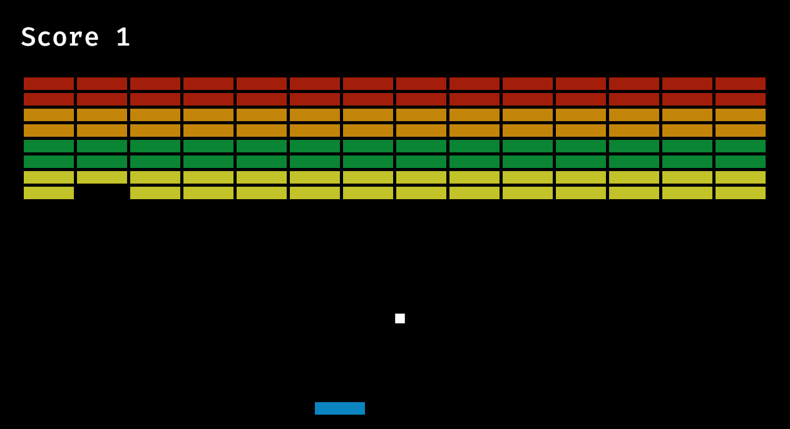

# Smashout

Smashout is a Rust game inspired by [Breakout](<https://en.wikipedia.org/wiki/Breakout_(video_game)>) and built with the Bevy ECS game engine. Experience the excitement of breaking bricks and mastering paddle controls in this classic arcade game brought back to life!



Give it a try by clicking [here](https://pacna.github.io/smashout/).

## Ubuntu Prerequisites

Before you embark on your adventure, ensure you have the following prerequisites installed on your Ubuntu system:

1. [Rust](https://www.rust-lang.org/tools/install)
2. [Make](https://www.gnu.org/software/make/)

## Installation and Running the Game

To install and run Smashout, run the following command:

```bash
$ make run
```

Alternatively, if you prefer to run the app in watch mode, run the following command (requires [cargo-watch](https://crates.io/crates/cargo-watch) to be installed):

```bash
$ make watch
```

## Instructions and Rules

Use the `Arrow Keys` to control the paddle. Your goal is to demolish all the bricks and emerge victorious. Enjoy the excitement of smashing your way to win!
